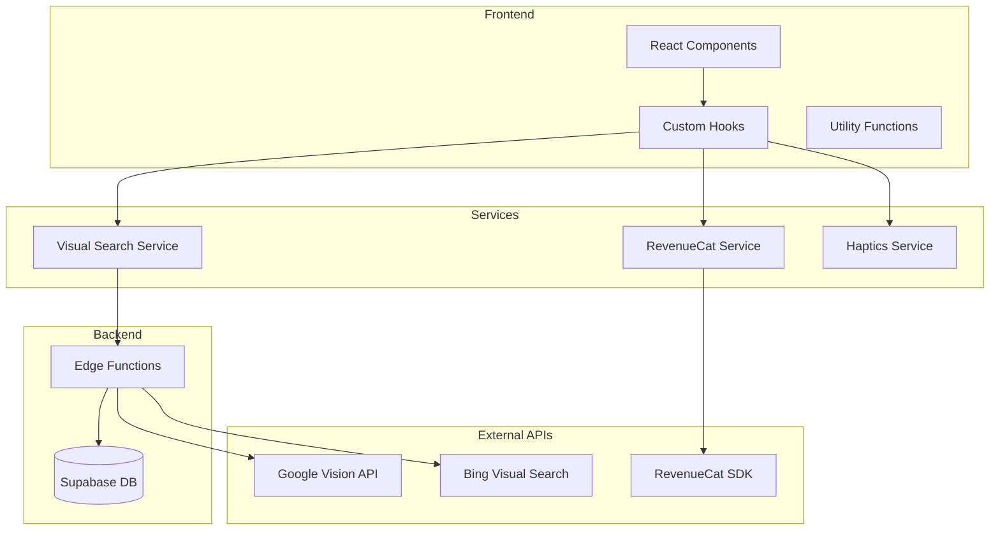

# Design Document: Affiliate Engine, Payment Gateway & UX Improvements

## Overview

Thiết kế tích hợp Visual Search API cho affiliate engine, RevenueCat cho payment gateway, và cải thiện UX/UI với màu sắc mới, haptic feedback, confetti effects, và enhanced loading states.

## Architecture



## Components and Interfaces

### 1. Visual Search Service

```typescript
// src/services/visualSearch.ts
interface VisualSearchResult {
  products: AffiliateProduct[];
  searchId: string;
  provider: 'google' | 'bing';
}

interface AffiliateProduct {
  id: string;
  name: string;
  price: number;
  currency: string;
  imageUrl: string;
  productUrl: string;
  platform: 'amazon' | 'shopee' | 'other';
  trackingUrl: string;
}

interface VisualSearchService {
  searchSimilarProducts(imageUrl: string): Promise<VisualSearchResult>;
  getTrackingUrl(product: AffiliateProduct, userId?: string): string;
}
```

### 2. RevenueCat Service

```typescript
// src/services/revenueCat.ts
interface RevenueCatConfig {
  apiKey: string;
  appUserId?: string;
}

interface Package {
  identifier: string;
  product: {
    identifier: string;
    title: string;
    description: string;
    price: number;
    priceString: string;
    currencyCode: string;
  };
  packageType: 'LIFETIME' | 'ANNUAL' | 'MONTHLY' | 'WEEKLY' | 'CUSTOM';
}

interface PurchaseResult {
  success: boolean;
  customerInfo?: CustomerInfo;
  error?: string;
}

interface CustomerInfo {
  entitlements: {
    active: Record<string, Entitlement>;
  };
  activeSubscriptions: string[];
}

interface RevenueCatService {
  initialize(config: RevenueCatConfig): Promise<void>;
  getOfferings(): Promise<Offering[]>;
  purchasePackage(pkg: Package): Promise<PurchaseResult>;
  restorePurchases(): Promise<CustomerInfo>;
  getCustomerInfo(): Promise<CustomerInfo>;
}
```

### 3. Haptics Service

```typescript
// src/services/haptics.ts
type HapticType = 'light' | 'medium' | 'heavy' | 'success' | 'warning' | 'error';

interface HapticsService {
  isSupported(): boolean;
  trigger(type: HapticType): void;
  triggerSelection(): void;
  triggerImpact(style: 'light' | 'medium' | 'heavy'): void;
  triggerNotification(type: 'success' | 'warning' | 'error'): void;
}
```

### 4. Enhanced Progress Indicator

```typescript
// src/components/tryOn/EnhancedProgressBar.tsx
interface ProgressStep {
  id: string;
  label: string;
  labelVi: string;
  duration: number; // estimated ms
}

const TRYON_STEPS: ProgressStep[] = [
  { id: 'scanning', label: 'Scanning Body...', labelVi: 'Đang quét cơ thể...', duration: 3000 },
  { id: 'warping', label: 'Warping Cloth...', labelVi: 'Đang điều chỉnh quần áo...', duration: 5000 },
  { id: 'finalizing', label: 'Finalizing...', labelVi: 'Đang hoàn thiện...', duration: 2000 },
];

interface EnhancedProgressBarProps {
  isVisible: boolean;
  currentStep: string;
  progress: number;
  onCancel?: () => void;
}
```

### 5. Confetti Service

```typescript
// src/services/confetti.ts
interface ConfettiConfig {
  particleCount?: number;
  spread?: number;
  origin?: { x: number; y: number };
  colors?: string[];
  duration?: number;
}

interface ConfettiService {
  fire(config?: ConfettiConfig): void;
  fireSuccess(): void; // Pre-configured for payment success
  fireUpgrade(): void; // Pre-configured for Pro upgrade
}
```

## Data Models

### Affiliate Click Tracking

```sql
-- Already exists in affiliate_clicks table
-- Add new columns for visual search tracking
ALTER TABLE affiliate_clicks ADD COLUMN IF NOT EXISTS
  search_id TEXT,
  search_provider TEXT,
  image_hash TEXT;
```

### RevenueCat Transaction Log

```sql
CREATE TABLE IF NOT EXISTS revenuecat_transactions (
  id UUID PRIMARY KEY DEFAULT gen_random_uuid(),
  user_id UUID REFERENCES auth.users(id) ON DELETE CASCADE,
  transaction_id TEXT NOT NULL,
  product_id TEXT NOT NULL,
  purchase_date TIMESTAMPTZ NOT NULL,
  expiration_date TIMESTAMPTZ,
  is_sandbox BOOLEAN DEFAULT false,
  store TEXT, -- 'app_store' | 'play_store'
  created_at TIMESTAMPTZ DEFAULT NOW()
);
```

## Color Theme Configuration

```typescript
// tailwind.config.ts additions
const colors = {
  // Background colors
  background: {
    DEFAULT: '#FFFFFF',
    secondary: '#F5F5F7',
  },
  
  // Primary CTA gradient
  primary: {
    DEFAULT: '#8E2DE2',
    gradient: {
      from: '#8E2DE2',
      to: '#4A00E0',
    },
  },
  
  // Gem colors
  gem: {
    DEFAULT: '#FFD700',
    light: '#FFE55C',
    dark: '#E6C200',
  },
};

// CSS class for magic gradient button
// .btn-magic {
//   background: linear-gradient(135deg, #8E2DE2 0%, #4A00E0 100%);
// }
```

## Correctness Properties

*A property is a characteristic or behavior that should hold true across all valid executions of a system-essentially, a formal statement about what the system should do. Properties serve as the bridge between human-readable specifications and machine-verifiable correctness guarantees.*

### Property 1: Affiliate Product Display Completeness

*For any* affiliate product returned from Visual Search API, the rendered product card SHALL display all required fields: image, name, price, and platform.

**Validates: Requirements 1.2, 1.3**

### Property 2: Tracking URL Construction

*For any* affiliate product and user, the generated tracking URL SHALL include the product URL, affiliate ID, and user tracking parameter.

**Validates: Requirements 1.4**

### Property 3: Haptic Feedback Triggers

*For any* haptic-triggering event (generate button tap, payment success, error), the haptics service SHALL be called with the appropriate feedback type, only if the device supports haptics.

**Validates: Requirements 4.1, 4.2, 4.3, 4.4**

### Property 4: Confetti on Success Events

*For any* successful payment or Pro upgrade event, the confetti animation SHALL be triggered exactly once.

**Validates: Requirements 5.1, 5.2**

### Property 5: Progress Step Sequence

*For any* AI try-on processing, the progress indicator SHALL display steps in the correct sequence: "Scanning Body" -> "Warping Cloth" -> "Finalizing", with progress percentage always increasing.

**Validates: Requirements 6.1, 6.2, 6.5**

### Property 6: Currency Localization

*For any* gem price display, the price SHALL be formatted according to the user's locale with the correct currency symbol and decimal format.

**Validates: Requirements 7.1, 7.3, 7.4**

### Property 7: Regional Price Tiers

*For any* user region (US or VN), the displayed gem prices SHALL match the configured price tier for that region.

**Validates: Requirements 7.2**

### Property 8: Purchase State Update

*For any* successful gem purchase of amount N, the user's gem balance SHALL increase by exactly N.

**Validates: Requirements 2.5**

### Property 9: Magic Gradient Application

*For any* primary CTA button, the button SHALL have the magic gradient style applied (from #8E2DE2 to #4A00E0).

**Validates: Requirements 3.2, 3.4**

## Error Handling

### Visual Search Errors

```typescript
interface VisualSearchError {
  code: 'API_ERROR' | 'RATE_LIMIT' | 'INVALID_IMAGE' | 'NO_RESULTS';
  message: string;
  fallbackProducts?: AffiliateProduct[];
}

// Fallback strategy:
// 1. If Google Vision fails, try Bing Visual Search
// 2. If both fail, show cached/sample products
// 3. Log error for monitoring
```

### RevenueCat Errors

```typescript
interface PurchaseError {
  code: 'CANCELLED' | 'PAYMENT_FAILED' | 'NETWORK_ERROR' | 'ALREADY_PURCHASED';
  message: string;
  userMessage: string; // Localized message for user
}

// Error handling:
// 1. Show user-friendly error message
// 2. Trigger error haptic
// 3. Allow retry for recoverable errors
// 4. Log error for monitoring
```

## Testing Strategy

### Unit Tests

- Test tracking URL construction with various inputs
- Test currency formatting for different locales
- Test progress step state machine
- Test haptic service capability detection

### Property-Based Tests

Using fast-check library:

1. **Affiliate Display Test**: Generate random products, verify all fields rendered
2. **Tracking URL Test**: Generate random products/users, verify URL structure
3. **Haptic Trigger Test**: Generate random events, verify correct haptic type
4. **Progress Sequence Test**: Generate random progress updates, verify monotonic increase
5. **Currency Format Test**: Generate random prices/locales, verify format correctness
6. **Regional Pricing Test**: Generate random regions, verify correct price tier

### Integration Tests

- Test Visual Search API integration with mock responses
- Test RevenueCat purchase flow with sandbox
- Test confetti animation triggers
- Test haptic feedback on supported devices

