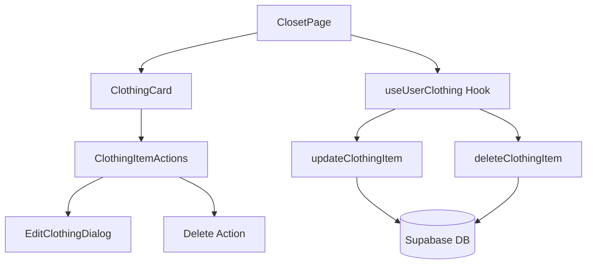

# Design Document: Clothing Edit/Delete Feature

## Overview

Tính năng này tích hợp các component có sẵn (`EditClothingDialog`, `ClothingItemActions`, `useUserClothing`) vào trang ClosetPage để cho phép người dùng sửa và xóa quần áo trong tủ đồ. Việc triển khai chủ yếu là kết nối các thành phần đã có sẵn.

## Architecture



## Components and Interfaces

### Existing Components (No Changes Needed)

1. **ClothingItemActions** (`src/components/clothing/ClothingItemActions.tsx`)
   - Dropdown menu với các options: Edit, Delete, Favorite, Hide
   - Props: `item`, `onEdit`, `onDelete`, `onToggleFavorite`, `onToggleHidden`

2. **EditClothingDialog** (`src/components/clothing/EditClothingDialog.tsx`)
   - Dialog cho phép sửa name và tags
   - Props: `item`, `isOpen`, `isSaving`, `onClose`, `onSave`

3. **useUserClothing** (`src/hooks/useUserClothing.ts`)
   - Hook quản lý clothing items
   - Methods: `updateClothingItem(id, {name, tags})`, `deleteClothingItem(id)`

### Modified Component

**ClosetPage** (`src/pages/ClosetPage.tsx`)
- Thêm state cho edit dialog
- Kết nối `ClothingItemActions` vào clothing grid
- Sử dụng `useUserClothing` hook thay vì fetch trực tiếp

## Data Models

### ClothingItem (Existing)
```typescript
interface ClothingItem {
  id: string;
  name: string;
  category: ClothingCategory;
  imageUrl: string;
  color?: string;
  gender?: 'male' | 'female' | 'unisex' | 'unknown';
  style?: string;
  pattern?: string;
  tags?: string[];
}
```

### Update Payload
```typescript
interface ClothingUpdatePayload {
  name?: string;
  tags?: string[];
}
```

## Correctness Properties

*A property is a characteristic or behavior that should hold true across all valid executions of a system-essentially, a formal statement about what the system should do. Properties serve as the bridge between human-readable specifications and machine-verifiable correctness guarantees.*

Based on the prework analysis, the following properties can be tested:

### Property 1: Edit preserves item identity
*For any* clothing item and any valid name/tags update, after saving the edit, the item should retain its original ID and category while reflecting the new name and tags.
**Validates: Requirements 1.3**

### Property 2: Cancel edit preserves original state
*For any* clothing item, opening the edit dialog and canceling should leave the item's name and tags unchanged in both UI and database.
**Validates: Requirements 1.4**

### Property 3: Delete removes item from list
*For any* clothing item in the user's closet, after successful deletion, the item should no longer appear in the clothing list.
**Validates: Requirements 2.2, 2.3**

### Property 4: Action menu only for owned items
*For any* clothing item displayed in the closet, the edit and delete options should only be available if the item belongs to the current user.
**Validates: Requirements 3.3**

## Error Handling

| Scenario | Handling |
|----------|----------|
| Update fails | Show error toast, keep dialog open with current values |
| Delete fails | Show error toast, keep item in UI |
| Network error | Show error toast with retry suggestion |
| Invalid input (empty name) | Prevent save, show validation message |

## Testing Strategy

### Unit Tests
- Test `ClothingItemActions` renders correct menu options
- Test `EditClothingDialog` pre-fills data correctly
- Test dialog close behavior on cancel

### Property-Based Tests
Using Vitest with fast-check library:

1. **Property 1**: Generate random valid updates, verify item retains ID and reflects new values
2. **Property 2**: Generate random items, simulate cancel, verify no changes
3. **Property 3**: Generate random items, delete, verify removal from list
4. **Property 4**: Generate items with different ownership, verify menu options

Each property-based test should run minimum 100 iterations.

Test annotation format: `**Feature: clothing-edit-delete, Property {number}: {property_text}**`
