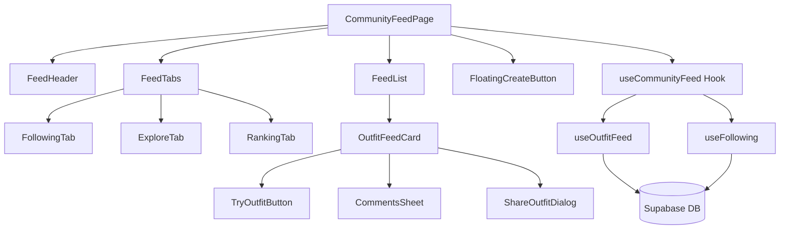

# Design Document: Community Feed

## Overview

Trang Community Feed là trung tâm xã hội của ứng dụng, nơi người dùng có thể duyệt, tương tác và chia sẻ outfit. Trang này mở rộng từ hook `useOutfitFeed` hiện có, thêm các tab Following/Explore/Ranking và tích hợp chặt chẽ với tính năng Try-On.

## Architecture



## Components and Interfaces

### New Components

1. **CommunityFeedPage** (`src/pages/CommunityFeedPage.tsx`)
   - Trang chính cho Community Feed
   - Quản lý state cho active tab
   - Render header, tabs, feed list, floating button

2. **FeedHeader** (`src/components/feed/FeedHeader.tsx`)
   - Header với title "Community Feed"
   - Saved button (navigate to SavedOutfitsPage)
   - User avatar (navigate to ProfilePage)

3. **FeedTabs** (`src/components/feed/FeedTabs.tsx`)
   - 3 tabs: Following, Explore, Ranking
   - Props: `activeTab`, `onTabChange`

4. **FloatingCreateButton** (`src/components/feed/FloatingCreateButton.tsx`)
   - Floating action button góc dưới phải
   - Navigate to create post flow

### Existing Components (Reuse)

1. **OutfitFeedCard** (`src/components/feed/OutfitFeedCard.tsx`)
   - Đã có sẵn, hiển thị post với đầy đủ thông tin
   - Đã tích hợp TryOutfitButton

2. **TryOutfitButton** (`src/components/feed/TryOutfitButton.tsx`)
   - Đã có sẵn, mở TryOutfitDialog

3. **CommentsSheet** (`src/components/feed/CommentsSheet.tsx`)
   - Đã có sẵn cho comments

4. **ShareOutfitDialog** (`src/components/outfit/ShareOutfitDialog.tsx`)
   - Đã có sẵn cho sharing

### New Hook

**useCommunityFeed** (`src/hooks/useCommunityFeed.ts`)
```typescript
interface UseCommunityFeedReturn {
  // Data
  outfits: SharedOutfit[];
  followingOutfits: SharedOutfit[];
  rankingOutfits: SharedOutfit[];
  
  // Loading states
  isLoading: boolean;
  isLoadingMore: boolean;
  hasMore: boolean;
  
  // Actions
  loadMore: () => void;
  refresh: () => void;
  
  // Tab-specific
  activeTab: 'following' | 'explore' | 'ranking';
  setActiveTab: (tab: 'following' | 'explore' | 'ranking') => void;
  
  // Interactions (from useOutfitFeed)
  hideOutfit: (id: string) => Promise<boolean>;
  saveOutfit: (id: string) => Promise<boolean>;
  unsaveOutfit: (id: string) => Promise<boolean>;
}
```

## Data Models

### SharedOutfit (Existing)
```typescript
interface SharedOutfit {
  id: string;
  title: string;
  description: string | null;
  result_image_url: string;
  likes_count: number;
  comments_count: number;
  is_featured: boolean;
  created_at: string;
  user_id: string;
  clothing_items: ClothingItemInfo[];
  user_profile?: {
    display_name?: string;
    avatar_url?: string;
  };
  isLiked?: boolean;
  isSaved?: boolean;
}
```

### FeedTab Type
```typescript
type FeedTab = 'following' | 'explore' | 'ranking';
```

## Correctness Properties

*A property is a characteristic or behavior that should hold true across all valid executions of a system-essentially, a formal statement about what the system should do. Properties serve as the bridge between human-readable specifications and machine-verifiable correctness guarantees.*

### Property 1: Following tab filters by followed users
*For any* set of outfits and a set of followed user IDs, the Following tab should only display outfits where the outfit's user_id is in the followed users set.
**Validates: Requirements 1.3**

### Property 2: Ranking tab sorts by likes descending
*For any* list of outfits in the Ranking tab, each outfit at index i should have likes_count >= outfit at index i+1.
**Validates: Requirements 1.5**

### Property 3: Load more appends items
*For any* feed state with hasMore=true, calling loadMore should result in the outfits array length increasing (assuming server returns data).
**Validates: Requirements 2.1**

### Property 4: Post rendering contains required elements
*For any* SharedOutfit with user_profile, clothing_items, and description, the rendered OutfitFeedCard should contain: username, avatar, timestamp, description, likes_count, comments_count, and clothing items section.
**Validates: Requirements 3.1, 3.3, 3.4, 3.5**

### Property 5: Try-on button visibility
*For any* SharedOutfit with clothing_items.length > 0, the TryOutfitButton should be visible in the OutfitFeedCard.
**Validates: Requirements 4.1**

### Property 6: Like toggle updates state correctly
*For any* outfit, toggling the like should flip isLiked boolean and adjust likes_count by +1 (if liking) or -1 (if unliking).
**Validates: Requirements 5.1**

## Error Handling

| Scenario | Handling |
|----------|----------|
| Feed load fails | Show error toast, display retry button |
| Load more fails | Show error toast, keep existing items |
| Like/Save fails | Show error toast, revert optimistic update |
| Try-on fails | Show error in TryOutfitDialog with retry option |
| Empty following list | Show "Follow users to see their outfits" message |
| No outfits in ranking | Show sample outfits as fallback |

## Testing Strategy

### Unit Tests
- Test FeedTabs renders 3 tabs correctly
- Test FeedHeader renders title, saved button, avatar
- Test FloatingCreateButton renders and handles click
- Test tab switching updates activeTab state

### Property-Based Tests
Using Vitest with fast-check library:

1. **Property 1**: Generate random outfits and followed user sets, verify filtering
2. **Property 2**: Generate random outfits with likes, verify sorting
3. **Property 3**: Generate feed states, simulate loadMore, verify length increase
4. **Property 4**: Generate random SharedOutfit, verify rendered elements
5. **Property 5**: Generate outfits with/without clothing_items, verify button visibility
6. **Property 6**: Generate outfits, simulate like toggle, verify state changes

Each property-based test should run minimum 100 iterations.

Test annotation format: `**Feature: community-feed, Property {number}: {property_text}**`
