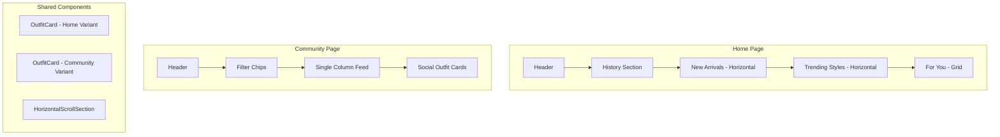

# Design Document: Home & Community Redesign

## Overview

Redesign hai trang chính của ứng dụng để tạo sự khác biệt rõ ràng:
- **Home Page**: Tập trung vào "Khám phá" - hiển thị lịch sử cá nhân và nội dung theo chủ đề
- **Community Page**: Tập trung vào "Người dùng" - giao diện social giống Instagram

## Architecture



## Components and Interfaces

### 1. HorizontalScrollSection Component

```typescript
interface HorizontalScrollSectionProps {
  title: string;
  icon: LucideIcon;
  items: OutfitItem[];
  onItemClick: (item: OutfitItem) => void;
  onTryItem: (item: OutfitItem) => void;
  showViewAll?: boolean;
  onViewAll?: () => void;
}

// Renders a horizontal scrollable section with outfit cards
// Used for "New Arrivals" and "Trending Styles" on Home page
```

### 2. HomeOutfitCard Component

```typescript
interface HomeOutfitCardProps {
  outfit: OutfitItem;
  onTry: () => void;
  onClick: () => void;
  variant: 'horizontal' | 'grid';
}

// Home page card with prominent "Try This" button
// Minimal user info overlay
// Focus on outfit image
```

### 3. CommunityOutfitCard Component

```typescript
interface CommunityOutfitCardProps {
  outfit: OutfitWithUser;
  onLike: () => void;
  onComment: () => void;
  onTry: () => void;
  onClick: () => void;
  layout: 'single-column' | 'masonry';
}

// Community page card with Instagram-style design
// Large user avatar (32px) and display name at top
// Caption text (2-3 lines) below image
// Subtle outline "Try" button
```

### 4. HistorySection Component (Enhanced)

```typescript
interface HistorySectionProps {
  items: TryOnHistoryItem[];
  isLoading: boolean;
  onItemClick: (item: TryOnHistoryItem) => void;
  onNewTryOn: () => void;
  onViewAll?: () => void;
}

// Horizontal scroll of recent try-on results
// "NEW" button at start
// Max 10 items
```

### 5. CommunityFeedLayout Component

```typescript
interface CommunityFeedLayoutProps {
  outfits: OutfitWithUser[];
  layout: 'single-column' | 'masonry';
  onOutfitClick: (id: string) => void;
  onLike: (id: string) => void;
  onComment: (id: string) => void;
  onTry: (outfit: OutfitWithUser) => void;
}

// Manages layout switching between single-column and masonry
// Single-column: Full-width cards like Instagram
// Masonry: Pinterest-style varying heights
```

## Data Models

### OutfitItem (Home Page)

```typescript
interface OutfitItem {
  id: string;
  title: string;
  result_image_url: string;
  likes_count: number;
  comments_count: number;
  clothing_items: ClothingItemRef[];
  user_profile?: {
    display_name?: string;
    avatar_url?: string;
  };
  created_at: string;
  category?: 'new' | 'trending' | 'for_you';
}
```

### OutfitWithUser (Community Page)

```typescript
interface OutfitWithUser extends OutfitItem {
  description: string | null;  // Caption text - required for community
  user_id: string;
  is_liked: boolean;
  is_saved: boolean;
  user_profile: {
    display_name: string;
    avatar_url: string | null;
    followers_count?: number;
  };
}
```

## UI Specifications

### Home Page Layout

```
┌─────────────────────────────────┐
│ Header                          │
├─────────────────────────────────┤
│ 🕐 Your Recent Looks    View All│
│ ┌──┐ ┌──┐ ┌──┐ ┌──┐ ┌──┐      │
│ │+ │ │  │ │  │ │  │ │  │ →    │
│ │NEW│ │  │ │  │ │  │ │  │      │
│ └──┘ └──┘ └──┘ └──┘ └──┘      │
├─────────────────────────────────┤
│ ✨ New Arrivals         View All│
│ ┌────┐ ┌────┐ ┌────┐          │
│ │    │ │    │ │    │ →        │
│ │    │ │    │ │    │          │
│ │TRY │ │TRY │ │TRY │          │
│ └────┘ └────┘ └────┘          │
├─────────────────────────────────┤
│ 🔥 Trending Styles      View All│
│ ┌────┐ ┌────┐ ┌────┐          │
│ │    │ │    │ │    │ →        │
│ │    │ │    │ │    │          │
│ │TRY │ │TRY │ │TRY │          │
│ └────┘ └────┘ └────┘          │
├─────────────────────────────────┤
│ 💫 For You                      │
│ ┌────┐ ┌────┐                  │
│ │    │ │    │                  │
│ │TRY │ │TRY │                  │
│ └────┘ └────┘                  │
│ ┌────┐ ┌────┐                  │
│ │    │ │    │                  │
│ │TRY │ │TRY │                  │
│ └────┘ └────┘                  │
└─────────────────────────────────┘
```

### Community Page Layout (Single Column)

```
┌─────────────────────────────────┐
│ Header                          │
├─────────────────────────────────┤
│ [Trending] [Latest] [Following] │
├─────────────────────────────────┤
│ ┌─────────────────────────────┐ │
│ │ 👤 Username                 │ │
│ │ ┌─────────────────────────┐ │ │
│ │ │                         │ │ │
│ │ │      Outfit Image       │ │ │
│ │ │                         │ │ │
│ │ └─────────────────────────┘ │ │
│ │ ❤️ 123  💬 45    [Try ⚡]  │ │
│ │ "Đi biển mặc bộ này siêu  │ │
│ │  xinh mọi người ơi..."    │ │
│ └─────────────────────────────┘ │
│                                 │
│ ┌─────────────────────────────┐ │
│ │ 👤 Another User             │ │
│ │ ...                         │ │
│ └─────────────────────────────┘ │
└─────────────────────────────────┘
```

### Card Design Comparison

| Aspect | Home Card | Community Card |
|--------|-----------|----------------|
| User Avatar | 24px, overlay | 32px, top header |
| User Name | Small, overlay | Prominent, top |
| Caption | None | 2-3 lines visible |
| Try Button | Full-width gradient | Small outline icon |
| Primary Action | Try outfit | View/Like |
| Image Aspect | 3:4 | 4:5 or 1:1 |


## Correctness Properties

*A property is a characteristic or behavior that should hold true across all valid executions of a system—essentially, a formal statement about what the system should do. Properties serve as the bridge between human-readable specifications and machine-verifiable correctness guarantees.*

### Property 1: History Section Item Limit

*For any* array of try-on history items passed to the History_Section component, the rendered output SHALL display at most 10 items, regardless of the input array length.

**Validates: Requirements 1.5**

### Property 2: Horizontal Section Item Count

*For any* array of outfit items passed to a HorizontalScrollSection component, the rendered output SHALL display between 6 and 10 items (or all items if fewer than 6 exist).

**Validates: Requirements 2.5**

### Property 3: Caption Rendering in Community Cards

*For any* OutfitWithUser object with a non-null description, the CommunityOutfitCard component SHALL render the caption text, truncated to at most 3 lines.

**Validates: Requirements 3.2**

## Error Handling

### Home Page Errors

| Error Scenario | Handling |
|----------------|----------|
| History fetch fails | Show empty state with "NEW" button |
| Outfit fetch fails | Show error message with retry button |
| Image load fails | Show placeholder image |

### Community Page Errors

| Error Scenario | Handling |
|----------------|----------|
| Feed fetch fails | Show error state with retry |
| Like action fails | Show toast error, revert optimistic update |
| User profile missing | Show default avatar and "User" name |

## Testing Strategy

### Unit Tests

- Test component rendering with various props
- Test click handlers call correct callbacks
- Test conditional rendering (empty states, loading states)
- Test layout switching between single-column and masonry

### Property-Based Tests

Using `fast-check` library for property-based testing:

1. **History Item Limit Property**: Generate arrays of 0-50 history items, verify rendered count ≤ 10
2. **Horizontal Section Count Property**: Generate arrays of 0-20 outfit items, verify rendered count is 6-10 (or all if < 6)
3. **Caption Truncation Property**: Generate outfit objects with descriptions of varying lengths, verify caption is rendered and truncated

### Integration Tests

- Test navigation between Home and Community pages
- Test filter chip interactions on Community page
- Test infinite scroll loading
- Test try-on flow from both pages

### Test Configuration

- Property tests: minimum 100 iterations per property
- Use Vitest as test runner
- Use React Testing Library for component tests
- Use fast-check for property-based testing
