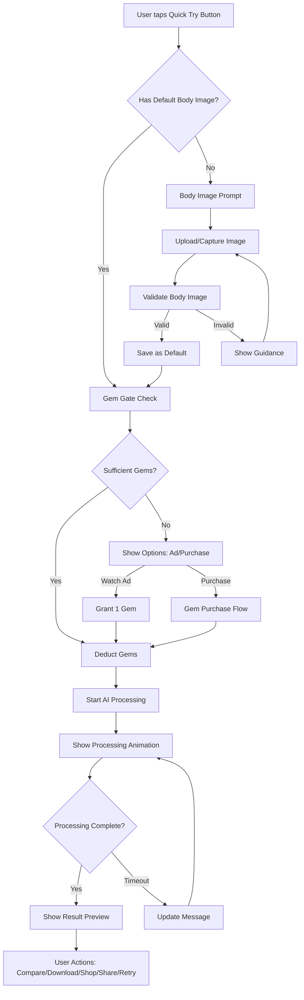

# Design Document: One-Tap Try-On Flow

## Overview

Tính năng One-Tap Try-On Flow tối ưu hóa trải nghiệm thử đồ ảo để đạt được mục tiêu "1 chạm = thử ngay". Thiết kế này tập trung vào việc giảm thiểu friction trong user journey từ lúc thấy outfit đẹp đến lúc xem kết quả try-on trên người mình.

### Design Goals
1. **Zero-friction try-on**: Người dùng có default body image có thể thử đồ với 1 tap
2. **Engaging wait experience**: Animation vui nhộn giữ user engaged trong 10-15s chờ AI
3. **Seamless monetization**: Gem gate được tích hợp mượt mà, không blocking
4. **Action-oriented results**: Result screen khuyến khích share, shop, và try more

## Architecture



## Components and Interfaces

### 1. QuickTryButton Component

```typescript
interface QuickTryButtonProps {
  outfitId?: string;
  clothingItem?: ClothingItem;
  onTryStart: () => void;
  size?: 'sm' | 'md' | 'lg';
  variant?: 'default' | 'overlay';
}

// Renders a prominent ⚡ button with gradient styling
// Positioned consistently on outfit/clothing cards
```

### 2. BodyImagePrompt Component

```typescript
interface BodyImagePromptProps {
  isOpen: boolean;
  onClose: () => void;
  onImageSelected: (imageUrl: string) => void;
  onSkip?: () => void;
}

// Modal dialog with options:
// - Upload from gallery
// - Take selfie with camera
// - Use previous body image (if available)
```

### 3. useOneTapTryOn Hook

```typescript
interface UseOneTapTryOnOptions {
  outfitId?: string;
  clothingItems?: ClothingItem[];
}

interface UseOneTapTryOnReturn {
  // State
  isProcessing: boolean;
  processingProgress: number;
  processingMessage: string;
  result: TryOnResult | null;
  error: Error | null;
  
  // Actions
  startTryOn: () => Promise<void>;
  retry: () => Promise<void>;
  reset: () => void;
  
  // Body image
  hasDefaultBodyImage: boolean;
  defaultBodyImageUrl: string | null;
  promptBodyImage: () => void;
}

// Orchestrates the entire one-tap flow:
// 1. Check for default body image
// 2. Handle gem gate
// 3. Trigger AI processing
// 4. Manage processing state
// 5. Return result
```

### 4. ProcessingAnimation Component

```typescript
interface ProcessingAnimationProps {
  progress: number; // 0-100
  estimatedTimeRemaining: number; // seconds
  isOvertime: boolean;
}

// Displays:
// - Animated skeleton loader
// - Rotating fun messages
// - Progress indicator
// - Time estimate
```

### 5. ResultPreview Component

```typescript
interface ResultPreviewProps {
  result: TryOnResult;
  originalBodyImage: string;
  clothingItems: ClothingItem[];
  onCompare: () => void;
  onDownloadHD: () => void;
  onShopNow: () => void;
  onShare: () => void;
  onTryAnother: () => void;
  onRetry: () => void;
}

// Full-screen result display with:
// - Long-press for before/after comparison
// - Action buttons at bottom
// - Clothing items carousel
```

### 6. GemGate Component

```typescript
interface GemGateProps {
  requiredGems: number;
  onSufficientGems: () => void;
  onWatchAd: () => void;
  onPurchase: () => void;
}

// Handles gem checking and options display
// Shows scarcity message when gems are low
```

## Data Models

### DefaultBodyImage (User Profile Extension)

```typescript
interface UserProfile {
  // ... existing fields
  default_body_image_url: string | null;
  default_body_image_updated_at: string | null;
}
```

### TryOnResult

```typescript
interface TryOnResult {
  id: string;
  result_image_url: string;
  body_image_url: string;
  clothing_items: ClothingItem[];
  created_at: string;
  background_preserved: boolean;
}
```

### ProcessingState

```typescript
interface ProcessingState {
  status: 'idle' | 'checking_gems' | 'processing' | 'completed' | 'error';
  progress: number;
  startTime: number;
  estimatedDuration: number;
  currentMessage: string;
}
```

## Correctness Properties

*A property is a characteristic or behavior that should hold true across all valid executions of a system—essentially, a formal statement about what the system should do. Properties serve as the bridge between human-readable specifications and machine-verifiable correctness guarantees.*

### Property 1: Body Image Prompt Shown When No Default

*For any* user without a default body image, when they tap the Quick Try Button, the system should display the Body Image Prompt dialog.

**Validates: Requirements 1.2, 3.2**

### Property 2: Body Image Validation Runs On Upload

*For any* image uploaded as a body image, the system should run validation to check if it contains a full body before accepting it.

**Validates: Requirements 1.3**

### Property 3: Validated Body Image Saved As Default

*For any* body image that passes validation, the system should save it as the user's default body image in their profile.

**Validates: Requirements 1.4**

### Property 4: Validation Failure Shows Guidance

*For any* body image that fails validation, the system should display helpful guidance on how to take a proper full-body photo.

**Validates: Requirements 1.6**

### Property 5: Quick Try Button Present On Cards

*For any* outfit card or clothing item card displayed in the app, the Quick Try Button should be visible at a consistent position.

**Validates: Requirements 2.1, 2.2**

### Property 6: Default Image Triggers Immediate Processing

*For any* user with a default body image and sufficient gems, tapping the Quick Try Button should immediately start AI processing without additional prompts.

**Validates: Requirements 3.1**

### Property 7: Gem Check Before Processing

*For any* try-on request, the system should check the user's gem balance before starting AI processing.

**Validates: Requirements 3.3**

### Property 8: Gem Deduction On Processing

*For any* user with sufficient gems who starts a try-on, the system should deduct the required gems before processing begins.

**Validates: Requirements 3.4**

### Property 9: Insufficient Gems Shows Options

*For any* user with insufficient gems who attempts a try-on, the system should show options to watch an ad or purchase gems instead of blocking.

**Validates: Requirements 3.5**

### Property 10: Processing State Shows Animation

*For any* try-on request that is processing, the system should display an animated skeleton loader with rotating messages and time estimate.

**Validates: Requirements 3.6, 4.1, 4.2, 4.3**

### Property 11: Processing Completion Shows Result

*For any* try-on request that completes successfully, the system should immediately display the Result Preview.

**Validates: Requirements 3.7**

### Property 12: Long Timeout Updates Message

*For any* try-on request that takes longer than the estimated time, the system should update the message to reassure the user.

**Validates: Requirements 4.4**

### Property 13: Long-Press Shows Comparison

*For any* Result Preview, when the user long-presses on the image, the system should show a Before/After comparison view.

**Validates: Requirements 5.2**

### Property 14: Result Preview Contains Action Buttons

*For any* Result Preview displayed, the system should show all required action buttons: Download HD, Shop Now, Share, Try Another, and Retry.

**Validates: Requirements 5.3, 5.4, 5.5, 5.6, 5.7**

### Property 15: Scarcity Message At Low Gems

*For any* user with exactly 1 gem remaining, the system should display a scarcity message encouraging them to choose wisely.

**Validates: Requirements 6.1**

### Property 16: Gem Balance Shown After Completion

*For any* successful try-on completion, the system should display the user's remaining gem balance.

**Validates: Requirements 6.4**

### Property 17: Background Fallback With Notification

*For any* try-on result where background preservation fails, the system should use a neutral background and notify the user.

**Validates: Requirements 7.3**

## Error Handling

### Network Errors
- Show retry button with friendly message
- Cache partial progress if possible
- Allow user to continue browsing while retrying in background

### AI Processing Errors
- Display specific error message based on error type
- Offer retry with same parameters
- Suggest alternative actions (try different outfit, check body image)

### Gem Transaction Errors
- Do not deduct gems if processing fails
- Refund gems if processing fails after deduction
- Show clear transaction status

### Body Image Validation Errors
- Provide specific guidance based on validation failure reason
- Show example of good body image
- Allow multiple retry attempts

## Testing Strategy

### Unit Tests
- Test QuickTryButton renders correctly with different props
- Test BodyImagePrompt handles all user actions
- Test ProcessingAnimation displays correct messages based on progress
- Test ResultPreview renders all action buttons
- Test GemGate handles all gem states correctly

### Property-Based Tests
Using Vitest with fast-check for property-based testing:

- **Property 1**: Generate random user states (with/without default image), verify prompt behavior
- **Property 5**: Generate random outfit/clothing cards, verify button presence
- **Property 6**: Generate users with default images and sufficient gems, verify immediate processing
- **Property 7-9**: Generate various gem balance scenarios, verify correct flow
- **Property 10-12**: Generate processing states, verify animation and message behavior
- **Property 13**: Generate result previews, verify long-press comparison
- **Property 14**: Generate result previews, verify all buttons present
- **Property 15**: Generate users with 1 gem, verify scarcity message

### Integration Tests
- Test complete one-tap flow from button tap to result display
- Test gem deduction and refund scenarios
- Test body image upload and validation flow
- Test retry and error recovery flows

### Configuration
- Minimum 100 iterations per property test
- Tag format: **Feature: one-tap-tryon-flow, Property {number}: {property_text}**
