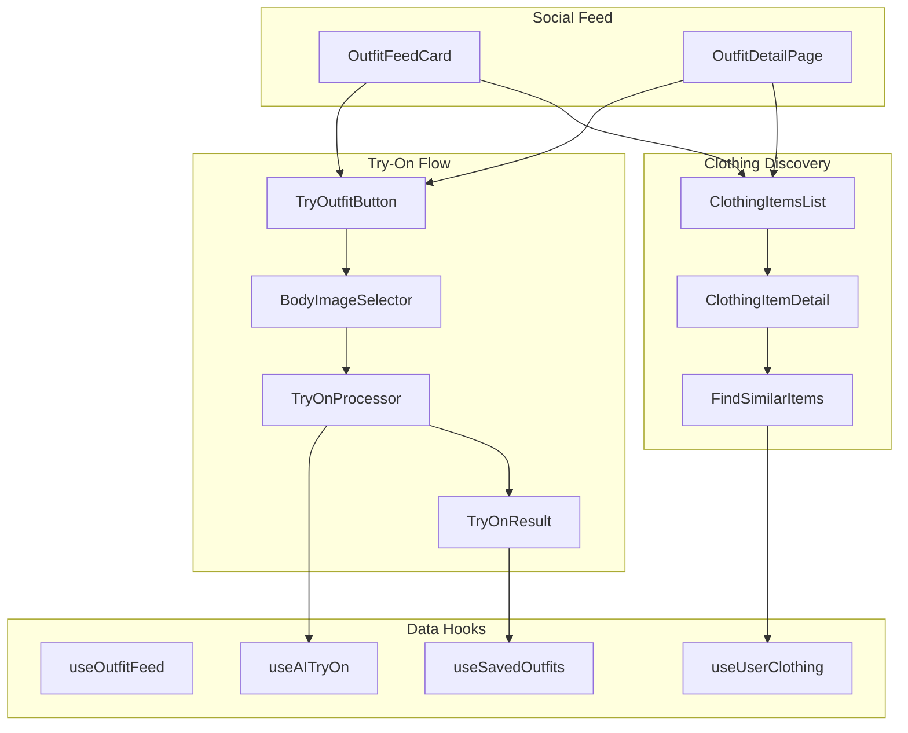

# Design Document: Try On Outfit from Feed

## Overview

Tính năng này mở rộng social feed hiện có để cho phép người dùng:
1. Mặc thử nguyên bộ outfit từ một bài đăng công khai lên ảnh của mình
2. Xem chi tiết và tìm kiếm các món đồ trong outfit

Tính năng tận dụng các components và hooks hiện có (`useAITryOn`, `TryOnCanvas`, `useUserClothing`) và thêm các components mới để kết nối social feed với try-on flow.

## Architecture



## Components and Interfaces

### New Components

#### 1. TryOutfitButton
Nút "Mặc thử outfit này" hiển thị trên OutfitFeedCard và OutfitDetailPage.

```typescript
interface TryOutfitButtonProps {
  outfit: SharedOutfit;
  variant?: 'icon' | 'full';
  onTryOn?: () => void;
}
```

#### 2. TryOutfitDialog
Dialog cho phép người dùng chọn/upload body image và bắt đầu try-on.

```typescript
interface TryOutfitDialogProps {
  open: boolean;
  onOpenChange: (open: boolean) => void;
  outfit: SharedOutfit;
  onSuccess?: (resultImageUrl: string) => void;
}
```

#### 3. ClothingItemsGrid
Grid hiển thị các món đồ trong outfit với khả năng tap để xem chi tiết.

```typescript
interface ClothingItemsGridProps {
  items: ClothingItemInfo[];
  onItemClick?: (item: ClothingItemInfo, index: number) => void;
  showShopLinks?: boolean;
}
```

#### 4. ClothingItemDetailSheet
Bottom sheet hiển thị chi tiết món đồ với các actions.

```typescript
interface ClothingItemDetailSheetProps {
  open: boolean;
  onOpenChange: (open: boolean) => void;
  item: ClothingItemInfo | null;
  onFindSimilar?: (item: ClothingItemInfo) => void;
  onAddToWardrobe?: (item: ClothingItemInfo) => void;
}
```

#### 5. SimilarItemsSheet
Bottom sheet hiển thị các món đồ tương tự từ wardrobe của user.

```typescript
interface SimilarItemsSheetProps {
  open: boolean;
  onOpenChange: (open: boolean) => void;
  sourceItem: ClothingItemInfo | null;
  similarItems: ClothingItem[];
  onSelectItem?: (item: ClothingItem) => void;
}
```

### Modified Components

#### OutfitFeedCard
Thêm TryOutfitButton vào action bar.

#### SharedOutfitDetailPage
Thêm section hiển thị clothing items và TryOutfitButton.

### New Hooks

#### useOutfitTryOn
Hook quản lý flow try-on từ outfit.

```typescript
interface UseOutfitTryOnReturn {
  startTryOn: (outfit: SharedOutfit) => void;
  isProcessing: boolean;
  progress: TryOnProgress;
  result: TryOnResult | null;
  bodyImage: string | null;
  setBodyImage: (image: string) => void;
  clearResult: () => void;
}
```

#### useSimilarClothing
Hook tìm kiếm món đồ tương tự trong wardrobe.

```typescript
interface UseSimilarClothingReturn {
  findSimilar: (item: ClothingItemInfo) => ClothingItem[];
  isSearching: boolean;
}
```

## Data Models

### ClothingItemInfo (existing, extended)
```typescript
interface ClothingItemInfo {
  name: string;
  imageUrl: string;
  shopUrl?: string;
  price?: string;
  category?: ClothingCategory;  // Added for similarity search
  color?: string;               // Added for similarity search
}
```

### TryOnFromOutfitResult
```typescript
interface TryOnFromOutfitResult {
  id: string;
  resultImageUrl: string;
  sourceOutfitId: string;       // Reference to original shared outfit
  bodyImageUrl: string;
  clothingItems: ClothingItemInfo[];
  createdAt: string;
}
```


## Correctness Properties

*A property is a characteristic or behavior that should hold true across all valid executions of a system-essentially, a formal statement about what the system should do. Properties serve as the bridge between human-readable specifications and machine-verifiable correctness guarantees.*

Based on the acceptance criteria analysis, the following properties must be verified:

### Property 1: All outfit items passed to try-on processor
*For any* shared outfit with N clothing items, when the try-on process is initiated, the AI processor SHALL receive exactly N clothing items with their imageUrl and name preserved.
**Validates: Requirements 1.3**

### Property 2: Clothing items count matches outfit data
*For any* shared outfit with N clothing items in its `clothing_items` array, the ClothingItemsGrid component SHALL render exactly N item components.
**Validates: Requirements 2.1**

### Property 3: Shop button visibility based on shopUrl
*For any* clothing item, the "Shop" button SHALL be visible if and only if the item has a non-empty `shopUrl` property.
**Validates: Requirements 2.3**

### Property 4: Similar items search returns same category
*For any* source clothing item with category C, all items returned by the similarity search SHALL have category equal to C, and results SHALL be sorted by relevance score (category match weight + color similarity).
**Validates: Requirements 3.2, 3.3**

### Property 5: Saved result contains source outfit reference
*For any* try-on result saved from a shared outfit, the saved record SHALL contain a `sourceOutfitId` field that matches the original shared outfit's ID.
**Validates: Requirements 4.2**

### Property 6: Shared result contains attribution
*For any* try-on result shared to the feed that originated from another outfit, the new shared outfit record SHALL contain an `inspired_by_outfit_id` field that matches the original outfit's ID.
**Validates: Requirements 5.2**

## Error Handling

### Try-On Process Errors
- Network timeout: Display retry button with "Kết nối không ổn định, thử lại?"
- AI service error: Display error message from API with retry option
- Invalid body image: Show validation error before starting process
- Missing clothing items: Prevent try-on if outfit has no items

### Data Loading Errors
- Failed to load outfit: Show error state with refresh option
- Failed to load user wardrobe: Show empty state for similar items search
- Failed to save result: Show toast error with retry option

### Authentication Errors
- Not logged in for save/share: Show LoginRequiredDialog
- Session expired: Redirect to login page

## Testing Strategy

### Property-Based Testing
Sử dụng `fast-check` library cho property-based testing trong TypeScript/React environment.

Mỗi property test sẽ:
- Chạy tối thiểu 100 iterations
- Generate random valid inputs (outfits, clothing items, user data)
- Verify the property holds for all generated inputs
- Tag với format: `**Feature: outfit-try-on-from-feed, Property {number}: {property_text}**`

### Unit Testing
- Test individual components render correctly
- Test hooks return expected data structures
- Test utility functions for data transformation

### Integration Testing
- Test full try-on flow from button click to result display
- Test save/share flows with mocked Supabase
- Test similar items search with sample wardrobe data

