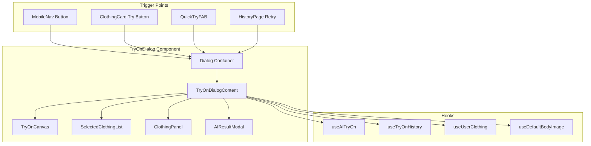

# Design Document: TryOn Popup Dialog

## Overview

Tính năng này tạo một dialog toàn màn hình để hiển thị giao diện thử đồ AI thay vì chuyển trang. Component `TryOnDialog` sẽ wrap lại logic từ `TryOnPage` hiện tại và hiển thị dưới dạng modal, cho phép người dùng thử đồ mà không mất context của trang hiện tại.

### Design Goals
- Tái sử dụng tối đa code từ `TryOnPage` hiện có
- Cung cấp trải nghiệm mượt mà với animation slide-up
- Hỗ trợ tất cả các flow hiện tại: manual try-on, quick try, history reuse
- Tích hợp seamless với các trigger points trong app

## Architecture



## Components and Interfaces

### TryOnDialog Component

```typescript
interface TryOnDialogProps {
  /** Controls dialog visibility */
  open: boolean;
  /** Callback when dialog should close */
  onOpenChange: (open: boolean) => void;
  /** Initial clothing item to try on */
  initialItem?: ClothingItem;
  /** Body image URL to reuse */
  reuseBodyImage?: string;
  /** Clothing items to reuse from previous session */
  reuseClothingItems?: ClothingItem[];
  /** History result data for retry flow */
  historyResult?: HistoryResultData;
  /** Garment URL for Quick Try flow */
  initialGarmentUrl?: string;
  /** Garment ID if from internal DB */
  initialGarmentId?: string;
  /** Auto-start AI processing when ready */
  autoStart?: boolean;
  /** Callback when try-on completes successfully */
  onSuccess?: (resultImageUrl: string) => void;
}

interface HistoryResultData {
  resultImageUrl: string;
  bodyImageUrl: string;
  clothingItems: Array<{ name: string; imageUrl: string }>;
}
```

### TryOnDialogContent Component

Internal component that contains the actual try-on UI, extracted from TryOnPage:

```typescript
interface TryOnDialogContentProps {
  /** All props from TryOnDialogProps except open/onOpenChange */
  initialItem?: ClothingItem;
  reuseBodyImage?: string;
  reuseClothingItems?: ClothingItem[];
  historyResult?: HistoryResultData;
  initialGarmentUrl?: string;
  initialGarmentId?: string;
  autoStart?: boolean;
  onSuccess?: (resultImageUrl: string) => void;
  /** Callback to close the dialog */
  onClose: () => void;
  /** Whether dialog can be closed (false during processing) */
  canClose: boolean;
}
```

### useTryOnDialog Hook

Custom hook to manage dialog state across the app:

```typescript
interface UseTryOnDialogReturn {
  /** Whether dialog is open */
  isOpen: boolean;
  /** Open dialog with optional initial data */
  openDialog: (options?: TryOnDialogOptions) => void;
  /** Close dialog */
  closeDialog: () => void;
  /** Current dialog options */
  options: TryOnDialogOptions | null;
}

interface TryOnDialogOptions {
  initialItem?: ClothingItem;
  reuseBodyImage?: string;
  reuseClothingItems?: ClothingItem[];
  historyResult?: HistoryResultData;
  initialGarmentUrl?: string;
  initialGarmentId?: string;
  autoStart?: boolean;
}
```

## Data Models

### Dialog State

```typescript
interface TryOnDialogState {
  // Body image
  bodyImage: string | undefined;
  
  // Selected clothing items
  selectedItems: ClothingItem[];
  
  // AI processing state
  isProcessing: boolean;
  aiProgress: AIProgress | null;
  aiResultImage: string | null;
  
  // UI state
  showClothingPanel: boolean;
  showResultModal: boolean;
  canClose: boolean;
  
  // Flags
  isResultSaved: boolean;
  hasAutoStarted: boolean;
}
```

### Integration Points

The dialog will be triggered from:

1. **MobileNav**: Replace navigation to `/try-on` with dialog open
2. **ClothingCard**: "Thử đồ" button opens dialog with item
3. **QuickTryFAB**: Opens dialog with garment URL
4. **HistoryPage**: Retry button opens dialog with history data
5. **CommunityFeed**: Try outfit button (already uses TryOutfitDialog pattern)

## Correctness Properties

*A property is a characteristic or behavior that should hold true across all valid executions of a system-essentially, a formal statement about what the system should do. Properties serve as the bridge between human-readable specifications and machine-verifiable correctness guarantees.*

### Property 1: Dialog renders with initial items
*For any* TryOnDialog opened with initialItem prop, the selectedItems state SHALL contain that item immediately after render.
**Validates: Requirements 3.1, 6.3**

### Property 2: Default body image loading
*For any* user with a default body image in their profile, when TryOnDialog opens without reuseBodyImage, the bodyImage state SHALL be set to the user's default body image.
**Validates: Requirements 2.1**

### Property 3: Body image persistence
*For any* body image set in the dialog, that image SHALL be retrievable from localStorage in subsequent sessions.
**Validates: Requirements 2.4**

### Property 4: Clothing list manipulation
*For any* clothing item added to selectedItems, it SHALL appear in the list; and for any item removed, it SHALL no longer appear in the list.
**Validates: Requirements 3.3, 3.4**

### Property 5: Try-on button enablement
*For any* dialog state where bodyImage is defined AND selectedItems.length > 0, the "Thử đồ AI" button SHALL be enabled; otherwise it SHALL be disabled.
**Validates: Requirements 4.1**

### Property 6: Result display on success
*For any* successful AI processing result, the aiResultImage state SHALL be set and the result modal SHALL be displayed.
**Validates: Requirements 4.3**

### Property 7: Close prevention during processing
*For any* dialog state where isProcessing is true, the canClose flag SHALL be false and closing attempts SHALL be blocked.
**Validates: Requirements 6.4**

### Property 8: Quick Try initialization
*For any* TryOnDialog opened with initialGarmentUrl, the selectedItems SHALL contain a clothing item with that URL as imageUrl.
**Validates: Requirements 7.1, 7.2**

### Property 9: Auto-start processing
*For any* dialog with autoStart=true AND bodyImage defined AND selectedItems.length > 0 AND user is authenticated AND hasQuotaRemaining, AI processing SHALL start automatically.
**Validates: Requirements 7.3**

## Error Handling

### Error Scenarios

1. **Body image upload fails**
   - Show toast with error message
   - Keep previous body image if any
   - Allow retry

2. **AI processing fails**
   - Show error toast
   - Clear processing state
   - Enable retry button
   - Reset cooldown timer

3. **Save fails**
   - Show error toast
   - Keep result displayed
   - Allow retry save

4. **Network errors**
   - Show appropriate error message
   - Maintain dialog state
   - Allow retry actions

### Error Recovery

```typescript
const handleError = (error: Error, context: string) => {
  console.error(`TryOnDialog error in ${context}:`, error);
  
  // Reset processing state
  setIsProcessing(false);
  setCanClose(true);
  
  // Show user-friendly error
  toast.error(getErrorMessage(error, context));
};
```

## Testing Strategy

### Unit Tests
- Test dialog renders correctly with various prop combinations
- Test close button behavior
- Test keyboard navigation (Escape to close)
- Test button states based on dialog state

### Property-Based Tests
Using `fast-check` for property-based testing:

1. **Property 1**: Generate random ClothingItem, verify it appears in selectedItems
2. **Property 2**: Generate random user profiles, verify body image loading
3. **Property 3**: Generate random image URLs, verify localStorage persistence
4. **Property 4**: Generate sequences of add/remove operations, verify list state
5. **Property 5**: Generate random combinations of bodyImage and selectedItems, verify button state
6. **Property 6**: Generate mock successful AI results, verify result display
7. **Property 7**: Generate processing states, verify canClose flag
8. **Property 8**: Generate garment URLs, verify initialization
9. **Property 9**: Generate various auto-start conditions, verify processing trigger

### Integration Tests
- Test full flow: open dialog → select body → select clothing → try on → save
- Test Quick Try flow integration
- Test history retry flow
- Test dialog state preservation across open/close cycles

### Test Configuration
- Minimum 100 iterations per property test
- Use `vitest` with `fast-check` integration
- Tag format: **Feature: tryon-popup-dialog, Property {number}: {property_text}**
